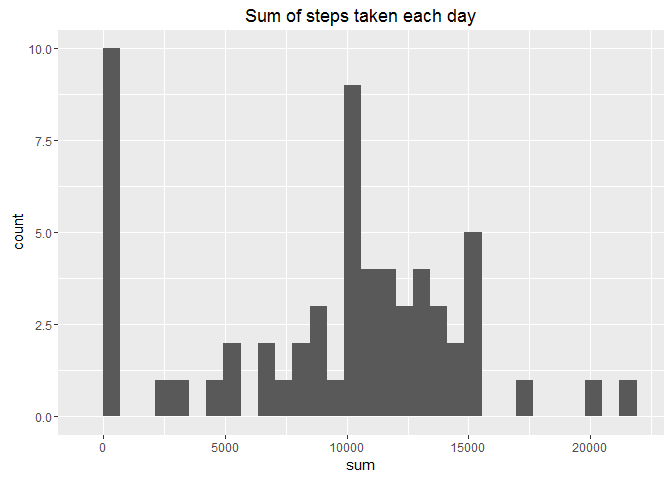
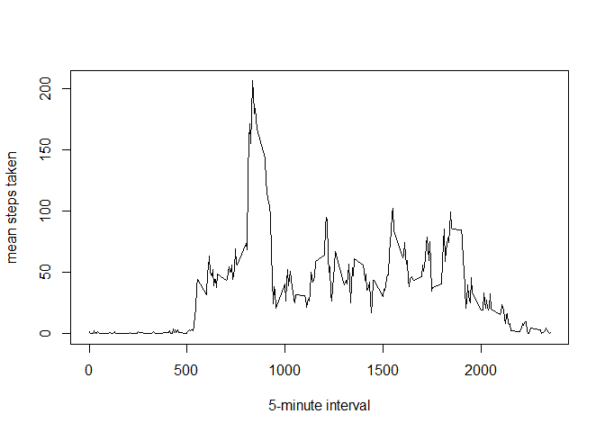
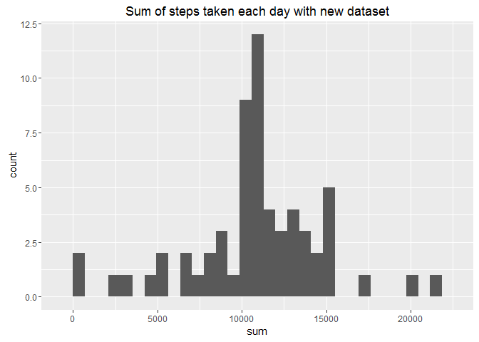
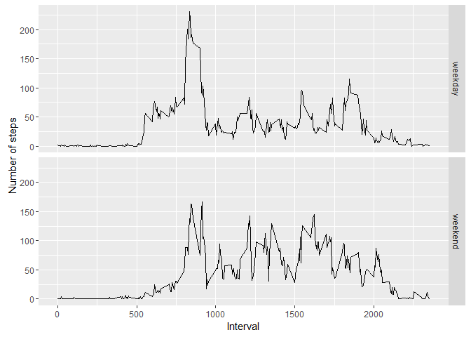

# Reproducible Research: Peer Assessment 1


## Loading and preprocessing the data


```r
unzip(zipfile = "activity.zip")
data <- read.csv("activity.csv")
```

## What is mean total number of steps taken per day?

### Histogram for total number of steps taken each day


```r
library(plyr)
library(ggplot2)
df <- ddply(data, .(date), summarize, sum = sum(steps, na.rm = TRUE))
ggplot(df, aes(x=sum)) + geom_histogram() + labs(title = "Sum of steps taken each day")
```

```
## `stat_bin()` using `bins = 30`. Pick better value with `binwidth`.
```



### mean and median of the total sum of steps taken each day

```r
mean(df$sum, na.rm = TRUE)
```

```
## [1] 9354.23
```

```r
median(df$sum, na.rm = TRUE)
```

```
## [1] 10395
```

## What is the average daily activity pattern?

### Time series plot (i.e. type = "l") of the 5-minute interval (x-axis) and the average number of steps taken, averaged across all days (y-axis)

```r
df <- ddply(data, .(interval), summarize, mean = mean(steps, na.rm = TRUE))
plot(df$interval, df$mean, type="l", xlab="5-minute interval", ylab="mean steps taken")
```



### 5-minute interval, on average across all the days in the dataset, contains the maximum number of steps?

```r
df[which.max(df$mean),]
```

```
##     interval     mean
## 104      835 206.1698
```

## Imputing missing values

### total number of missing values in the dataset

```r
sum(is.na(data$steps))
```

```
## [1] 2304
```

### Fill missing values by using mean for that 5-minute interval
### create a new data set with filled missing values

```r
testfun <- function(x, y)
{
    if(is.na(x))
    {
      d <- df_mean[df_mean$interval == y,]
      x <- d[[2]]
    }
    else
    {
      x <- x
    }
}

new_data <- data
df_mean <- ddply(data, .(interval), summarize, mean = mean(steps, na.rm = TRUE))
new_data$steps <- mapply(testfun, data$steps, data$interval)
```

### Histogram for total number of steps taken each day with new dataset

```r
df <- ddply(new_data, .(date), summarize, sum = sum(steps, na.rm = TRUE))
ggplot(df, aes(x=sum)) + geom_histogram() + labs(title = "Sum of steps taken each day with new dataset")
```

```
## `stat_bin()` using `bins = 30`. Pick better value with `binwidth`.
```



### mean and median of the total sum of steps taken each day with new dataset

```r
mean(df$sum, na.rm = TRUE)
```

```
## [1] 10766.19
```

```r
median(df$sum, na.rm = TRUE)
```

```
## [1] 10766.19
```

After imputing missing data, the mean and media values have increased. This is due to not having any zero values which were reducing the mean and median with the original data. Also seen is that mean and median turns out to be same.

## Are there differences in activity patterns between weekdays and weekends?

### Create a new variable and add a weekday column to tell if a date is a weekday or weekend

```r
daytype <- function(date)
{
  day <- weekdays(date)
  if (day %in% c("Monday", 
                 "Tuesday", 
                 "Wednesday", 
                 "Thursday", 
                 "Friday"))
  {
    return("weekday")
  }
  else
  {
    return("weekend")
  }
}

daytype_data <- new_data
daytype_data$date <- as.Date(daytype_data$date)
daytype_data$day <- mapply(daytype, daytype_data$date)
```

### Make a time series plot to show weekday and weekend plot

```r
df <- ddply(daytype_data, .(interval,day), summarize, mean = mean(steps, na.rm = TRUE))
ggplot(df, aes(interval, mean)) + geom_line() + facet_grid(day ~ .) + xlab("Interval") + ylab("Number of steps")
```



It looks like that average activity is more during weekends compared to weekdays ?
